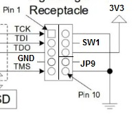

# SF2000
Spitfire 2000

***

BOM Rev. 1B
---------
Designator  | Name/Value   | Package | Notes
-|-|-|-|
U1 | Voltage Regulator 3.3V,   LM1117-3.3 or   AMS1117-3.3 | SOT-223 | 3.3V 1A Low Drop-Out (LDO) Voltage regulator. https://www.aliexpress.com/item/32869037691.html
U2 | Voltage Regulator 4.3V, TPS73643DBVR or   ABLIC S-1200B43-M5T1U or   MIC5205YM5-TR ADJ (with R1,R2 and C7 populated) | SOT-23-5 | 4.3V LDO Voltage Regulator * [TPS73643DBVR](https://www.mouser.com/ProductDetail/595-TPS73643DBVR)  * [S-1200B43-M5T1U](https://www.mouser.com/ProductDetail/ABLIC/S-1200B43-M5T1U?qs=sE1HjTVAc2gE62dbjIRSRQ%3D%3D)  * [MIC5205YM5-TR](https://www.mouser.com/ProductDetail/Microchip-Technology-Atmel/MIC5205YM5-TR?qs=U6T8BxXiZAUCsfGqlmZYIw%3D%3D) (Adjustable, populate R1,R2,C7)
U3 | Inverter Schmitt Trigger 74LVC2G14GV,125 | TSOP-6/SOT457/SC-74 | * [LVC2G14GV125](https://www.mouser.com/ProductDetail/771-LVC2G14GV125)
U4,U5,U6 | Digital Bus Switch ICs 24-Bit FET, SN74CBT16211ADGGR | TSSOP-56 | FET Level-shifter   * [SN74CBT16211ADGGR](https://www.mouser.com/ProductDetail/595-SNCBT16211ADGGR)   * [SN74CBT16811CDGG](https://www.mouser.com/ProductDetail/595-SN74CBT16811CDGG)
U7 | XNOR gate w/ Schmitt Trigger SN74AUP1T87DCKR |TSSOP-5/SC-70-5/SOT-353-1 | Generates 7 MHz CLK from CCK XNOR CCKQ   * [SN74AUP1T87DCKR](https://www.mouser.com/ProductDetail/595-SN74AUP1T87DCKR)
U8 | Gowin FPGA GW1N-UV9LQ144C6/I5 | LQFP-144 | FPGA - Field Programmable Gate Array, 8640 LE, 120 I/O   * [GW1N-UV9LQ144C6/I5](https://www.mouser.com/ProductDetail/192-GW1NUV9LQ144C6I5)
U9 | Motorola CPU MC68SEC000AA20 | QFP-64 | MPU 32-bit 20MHz   Contact Eriond to buy a NOS CPU for a reasonable price
U10,U11 | SRAM ISSI IS61WV20488FBLL-10TLI  | TSOP-44 | First 4 MB SRAM  High-Speed, Async, 2Mbx8, 10ns, 2.4v-3.6v, 44 Pin TSOP II, RoHS   * [61W20488FBLL10TI](https://eu.mouser.com/ProductDetail/870-61W20488FBLL10TI)
U12,U13 | SRAM ISSI IS61WV20488FBLL-10TLI  | TSOP-44 | Second 4 MB (Optional) --"--  
U14 | NOR Flash SST39LF040-55-4C-NHE-T | PLCC-32 | NOR Flash 3.0 to 3.6V (For Oktagon/Oktapus. IDE-driver)   * [SST39LF040554CN](https://www.mouser.com/ProductDetail/579-SST39LF040554CN)   (or 39LF020, 39LF010)
U15 | SST39LF802C-55-4C-EKE | TSOP-48 | NOR Flash 3.0 to 3.6V 8Mbit Multi-Purpose Flash (for Kickstart)   * [S39LF802C554CEKE](https://www.mouser.com/ProductDetail/579-S39LF802C554CEKE)
U16,U17,U18 | Bus Transceiver 74LVC245APW,118  | TSSOP-20 | * [74LVC245APW-T](https://www.mouser.com/ProductDetail/771-74LVC245APW-T)
J1 | Goldfingers on PCB | ENIG | Order PCB with Goldfingers, ENIG and 45 degrees chamfered edge (or chamfer the edge yourself)
J2 | JTAG-header | Dual row 2.54mm (2 x 5) Pin Male Header Strip | 
